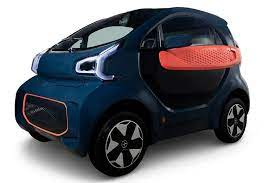

# Tema1





Se verán los sigueinetes apartados:
1.sadsa
2.adssa
3.dasdsa
4.dasd
5. ~~dsadas~~


---

> Ejemplo:codigo Java.


```java
package ejercicios.com;

import java.util.Scanner;

public class Arrays {

	public static void main(String[] args) {
		
		Scanner teclado = new Scanner(System.in);
	
		System.out.println("De que tamaño quiere su vector?");
		int [] a = new int [teclado.nextInt()];
		
		for(int i = 0; i < a.length; i++) {
			System.out.println(a[i]);
		}
	
	}	
}


```

> Tabla:Ejemplo tabla.
---

LENGUAJE	|	INVENTOR	|	AÑO
----------------|-----------------------|----------------
Javascript      | James			| 1995
Java     	| James			| 1995
phyton     	| Fan de montyphyton	| 2312321
---


> Ejemplo:codigo Javascript.


>```javascript
>var numero = 5
>```
